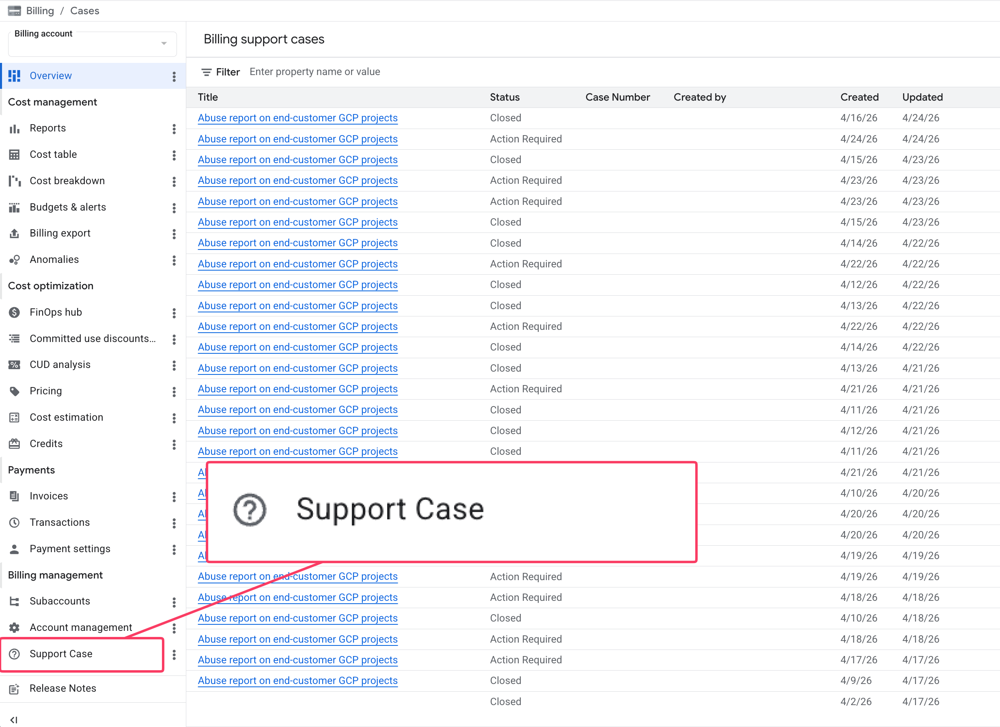

# GCP Billing Support Navigator

A Chrome Extension that enhances the Google Cloud Platform (GCP) Billing Console by injecting a direct link to "Support Cases" in the navigation sidebar.

## Features

- **Automatic ID Extraction**: Dynamically detects your Billing Account ID from the URL.
- **Native Integration**: Mimics the GCP UI style (Material Icons, typography, and spacing) to feel like a native feature.
- **SPA Compatibility**: Uses `MutationObserver` to ensure the menu item remains visible even during dynamic page updates.
- **Smart Logic**: Handles Shadow DOM traversal to reliably find the navigation menu.

## Project Structure

- `manifest.json`: Extension configuration (Manifest V3).
- `content.js`: Main logic for DOM manipulation and ID extraction.
- `styles.css`: Custom styles for pixel-perfect integration.
- `icons/`: Extension icons.

## Installation

1. Clone or download this repository.
2. Open Chrome and navigate to `chrome://extensions/`.
3. Enable **Developer mode** in the top right corner.
4. Click **Load unpacked** and select the extension folder.
5. Visit any GCP Billing page (e.g., `https://console.cloud.google.com/billing/...`) to see the new menu item.

## Technical Details

The extension watches for the "Account management" menu item and injects the "Support Case" item directly below it. It is designed to work seamlessly with GCP's Single Page Application (SPA) architecture.
